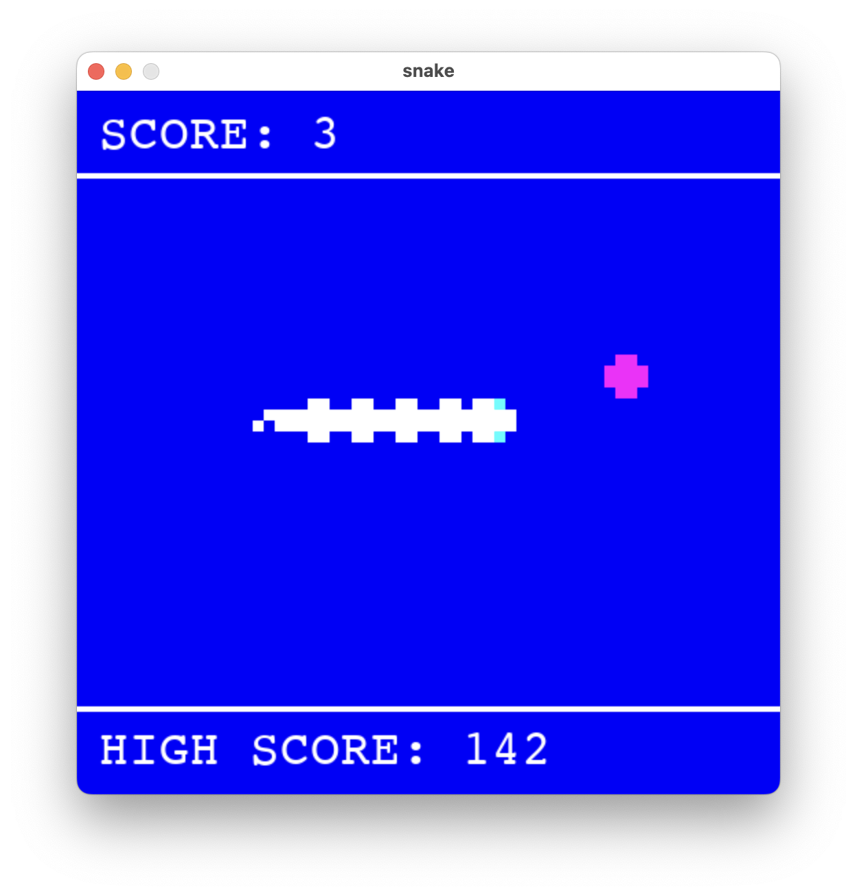

# Snake (Pygame)

<video src="https://github.com/user-attachments/assets/28f05d46-1446-4381-b97d-870463ae0a3d" autoplay loop muted playsinline width="100%"></video>

(Above is a beautiful gameplay with a volcano theme.)
A clone of the classic Snake game, written in Python using the Pygame library.

This project represents a significant architectural milestone in my learning. It successfully transitioned from a monolithic codebase (over 650 lines in a single file) to a clean, scalable structure using several design patterns.

## What I Learned in This Project

Compared to my previous projects (Pong, Breakout, Space Invaders), this game introduces several software engineering concepts:

1. **State Pattern:**
   - Game logic is no longer cluttered with endless `if menu_active:` or `if game_over:` checks. 
   - Every screen is an isolated class (`MenuState`, `PlayState`, `GameOverState`, `SettingsState`) inside `states.py`. The main `Game` class simply delegates events, updates, and drawing to the `current_state`.

2. **Asset Management:**
   - Implemented a dedicated `AssetManager` class to handle loading and caching of all media files (spritesheets and sound effects). This prevents memory leaks, duplicate loading, and adheres to the Single Responsibility Principle.

3. **Persistent Configuration:**
   - Extracted hardcoded settings into a dynamic `config_manager.py` that reads and writes to a `config.json` file.
   - The game now remembers your high score, selected theme, graphics mode, and volume level even after closing!

## Features

- **Classic Gameplay:** Eat food to grow longer and score points. The snake moves faster as your score increases!
- **8 Unique Color Themes:** Play in Classic, Terminal, Cyberpunk, Royal, Aqua Wave, Iceberg, Taxi, or Volcano styles.
- **Two Graphics Modes:** 
  - `MINIMAL`: Clean, retro solid-color rectangles.
  - `SPRITES`: Detailed textures sliced dynamically from a single spritesheet.
- **Persistent High Scores:** Your best score is saved locally.
- **Dynamic Audio:** Crunch sounds when eating, with adjustable volume (0-9).
- **Pause System:** Press space to pause the game at any time.



## Controls

| Key | Action |
|---------|----------|
| **↑ ↓ ← →** | Move Snake |
| **Space** | Pause Game |
| **Enter** | Start / Restart Game |
| **Tab** | Open Settings |
| **Q / Esc** | Quit / Return to Menu |

*In Settings Menu:*
| Key | Action |
|---------|----------|
| **← / →** | Change Theme |
| **↑ / ↓** | Toggle Graphics Mode (Sprites / Minimal) |
| **0 - 9** | Adjust Volume Level |

## Project Structure

```
snake/
│
├── scripts/
│   ├── game.py              # Main Context class managing the loop and states
│   ├── states.py            # Implementation of the State Pattern (Menu, Play, etc.)
│   ├── entities.py          # Models: Snake and Food logic
│   ├── assets_manager.py    # Centralized loader for sounds and images
│   ├── config_manager.py    # JSON read/write logic
│   ├── constants.py         # Global constants and Enums
│   └── __init__.py          # Marks the folder as a package
│
├── main.py                  # Clean entry point
├── config.json              # Auto-generated save file
├── images/                  # Graphical assets (theme_spritesheet.png)
├── sound/                   # Sound effects (crunch.wav)
└── README.md
```

## Installation & Running

1. Ensure you have Python 3 installed.
2. Install the required Pygame library:
   ```bash
   pip install pygame-ce
   ```
3. Run the game from the root directory:
   ```bash
   python main.py
   ```

## Play in Browser

You can play the game directly in your browser without installing anything! 
**👉 [Play Snake here](https://claudere0.github.io/snake/)**

### ⚠️ Important Notes for the First Launch:
- When you open the link for the first time, you will see a blank turquoise (light-green/blue) screen. **Please wait!** It can take anywhere from 30 seconds to 3 minutes for the pygbag and Python environment to download and cache in your browser.
- Once the loading is complete, a gray screen with blue text saying **"Ready to start!"** will appear.
- Simply **click once** on that text, and the game will start immediately.
- *Note: Subsequent launches will be much faster since the game files will already be saved in your browser's cache.*